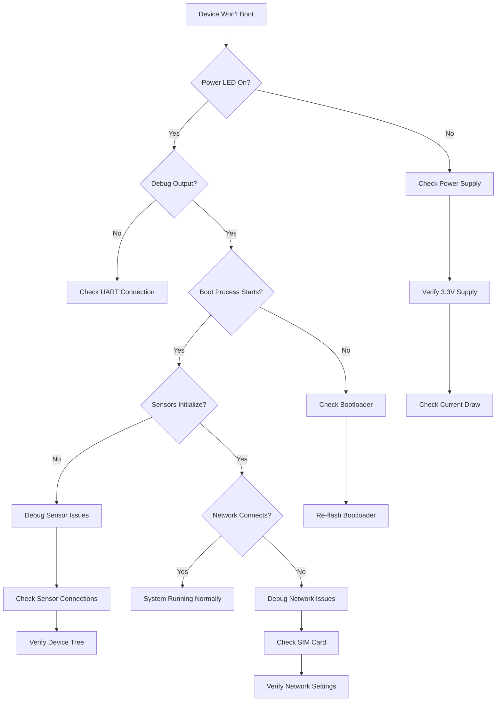
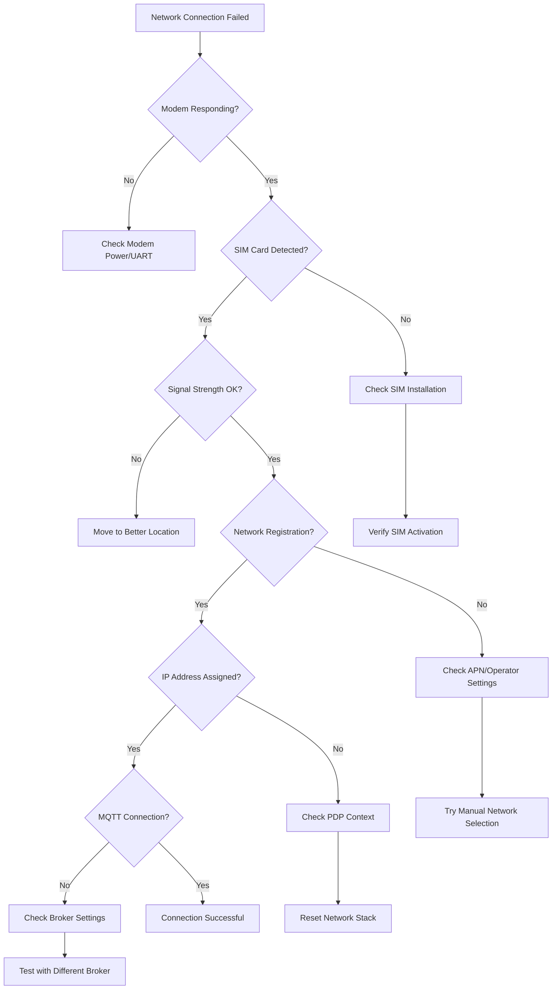

# Debugging and Troubleshooting Guide - Nordic Thingy91 DK Demo

## Overview
This comprehensive debugging and troubleshooting guide provides systematic approaches for identifying, diagnosing, and resolving issues in the Nordic Thingy91 DK demo. It includes diagnostic tools, common problem patterns, root cause analysis techniques, and step-by-step resolution procedures.

## Debugging Infrastructure

### Debug Configuration

#### Build Configuration for Debugging
```cmake
# CMakeLists.txt - Debug configuration
if(CMAKE_BUILD_TYPE STREQUAL "Debug")
    # Enable debug symbols
    target_compile_options(app PRIVATE -g -O0)
    
    # Enable debug assertions
    target_compile_definitions(app PRIVATE
        -DCONFIG_DEBUG=1
        -DCONFIG_ASSERT=1
        -DCONFIG_LOG_DEFAULT_LEVEL=4  # Debug level logging
        -DCONFIG_THREAD_STACK_INFO=1
        -DCONFIG_THREAD_NAME=1
        -DCONFIG_DEBUG_THREAD_INFO=1
    )
    
    # Enable memory debugging
    target_compile_definitions(app PRIVATE
        -DCONFIG_HEAP_MEM_POOL_SIZE=32768
        -DCONFIG_DEBUG_INFO=1
    )
endif()
```

#### Logging Framework Configuration
```c
// debug_config.h
#include <logging/log.h>

// Module-specific log levels
LOG_MODULE_REGISTER(main, LOG_LEVEL_DBG);
LOG_MODULE_REGISTER(sensor_manager, LOG_LEVEL_DBG);
LOG_MODULE_REGISTER(cellular_manager, LOG_LEVEL_DBG);
LOG_MODULE_REGISTER(mqtt_client, LOG_LEVEL_DBG);
LOG_MODULE_REGISTER(power_manager, LOG_LEVEL_DBG);

// Debug macros for different severity levels
#define DEBUG_PRINT(fmt, ...) LOG_DBG(fmt, ##__VA_ARGS__)
#define INFO_PRINT(fmt, ...)  LOG_INF(fmt, ##__VA_ARGS__)
#define WARN_PRINT(fmt, ...)  LOG_WRN(fmt, ##__VA_ARGS__)
#define ERROR_PRINT(fmt, ...) LOG_ERR(fmt, ##__VA_ARGS__)

// Function entry/exit tracing
#define FUNC_ENTRY() LOG_DBG("Entering %s", __func__)
#define FUNC_EXIT()  LOG_DBG("Exiting %s", __func__)

// Variable dumping macros
#define DUMP_INT(var)    LOG_DBG("%s = %d", #var, var)
#define DUMP_HEX(var)    LOG_DBG("%s = 0x%x", #var, var)
#define DUMP_STR(var)    LOG_DBG("%s = %s", #var, var)
#define DUMP_PTR(var)    LOG_DBG("%s = %p", #var, (void*)var)
```

### Hardware Debugging Setup

#### SWD Debugging Interface
```bash
#!/bin/bash
# debug_setup.sh - Configure hardware debugging

# Connect J-Link debugger
export SEGGER_JLINK_PATH="/opt/SEGGER/JLink"
export JLINK_DEVICE="nRF9160_xxAA"

# Start J-Link GDB server
JLinkGDBServerCLExe -select USB -device $JLINK_DEVICE -endian little \
    -if SWD -speed 4000 -LocalhostOnly &

# Launch GDB with Zephyr support
arm-none-eabi-gdb build/zephyr/zephyr.elf \
    -ex "target remote localhost:2331" \
    -ex "monitor reset" \
    -ex "monitor halt" \
    -ex "load" \
    -ex "monitor reset" \
    -ex "continue"
```

#### UART Debug Console Configuration
```c
// uart_debug.c
#include <drivers/uart.h>

static const struct device *uart_dev;
static char debug_buffer[256];
static size_t debug_buffer_pos = 0;

void debug_console_init(void) {
    uart_dev = device_get_binding("UART_0");
    if (!uart_dev) {
        ERROR_PRINT("UART device not found");
        return;
    }
    
    // Configure UART for debug output
    struct uart_config uart_cfg = {
        .baudrate = 115200,
        .parity = UART_CFG_PARITY_NONE,
        .stop_bits = UART_CFG_STOP_BITS_1,
        .data_bits = UART_CFG_DATA_BITS_8,
        .flow_ctrl = UART_CFG_FLOW_CTRL_NONE
    };
    
    uart_configure(uart_dev, &uart_cfg);
    INFO_PRINT("Debug console initialized at 115200 baud");
}

void debug_print_buffer(const uint8_t *buffer, size_t length) {
    DEBUG_PRINT("Buffer dump (%zu bytes):", length);
    for (size_t i = 0; i < length; i++) {
        if (i % 16 == 0) {
            printk("\n%04x: ", i);
        }
        printk("%02x ", buffer[i]);
    }
    printk("\n");
}
```

## Common Problem Categories

### 1. Sensor Interface Issues

#### Problem: BME680 Not Responding
```c
// sensor_diagnostics.c
typedef enum {
    SENSOR_DIAG_OK,
    SENSOR_DIAG_I2C_ERROR,
    SENSOR_DIAG_DEVICE_NOT_FOUND,
    SENSOR_DIAG_CALIBRATION_ERROR,
    SENSOR_DIAG_TIMEOUT,
    SENSOR_DIAG_POWER_ERROR
} sensor_diag_result_t;

sensor_diag_result_t diagnose_bme680_issues(const struct device *dev) {
    FUNC_ENTRY();
    
    // Step 1: Check device binding
    if (!dev) {
        ERROR_PRINT("BME680 device not bound");
        return SENSOR_DIAG_DEVICE_NOT_FOUND;
    }
    
    // Step 2: Test I2C communication
    uint8_t chip_id;
    int ret = i2c_reg_read_byte(dev, BME680_I2C_ADDR, BME680_REG_CHIP_ID, &chip_id);
    if (ret != 0) {
        ERROR_PRINT("I2C communication failed: %d", ret);
        return SENSOR_DIAG_I2C_ERROR;
    }
    
    // Step 3: Verify chip ID
    if (chip_id != BME680_CHIP_ID) {
        ERROR_PRINT("Invalid chip ID: expected 0x%02x, got 0x%02x", 
                   BME680_CHIP_ID, chip_id);
        return SENSOR_DIAG_DEVICE_NOT_FOUND;
    }
    
    // Step 4: Check power supply
    uint8_t status;
    ret = i2c_reg_read_byte(dev, BME680_I2C_ADDR, BME680_REG_STATUS, &status);
    if (ret == 0 && (status & BME680_NEW_DATA_MSK)) {
        DEBUG_PRINT("BME680 power and communication OK");
        return SENSOR_DIAG_OK;
    }
    
    ERROR_PRINT("BME680 status register indicates issues: 0x%02x", status);
    return SENSOR_DIAG_POWER_ERROR;
}

void troubleshoot_sensor_issues(void) {
    const struct device *bme680_dev = device_get_binding("BME680");
    sensor_diag_result_t result = diagnose_bme680_issues(bme680_dev);
    
    switch (result) {
    case SENSOR_DIAG_I2C_ERROR:
        WARN_PRINT("Troubleshooting steps:");
        WARN_PRINT("1. Check I2C bus wiring (SDA, SCL, GND, VCC)");
        WARN_PRINT("2. Verify pull-up resistors on I2C lines");
        WARN_PRINT("3. Check I2C bus frequency (max 400kHz for BME680)");
        WARN_PRINT("4. Test with I2C bus scanner");
        break;
        
    case SENSOR_DIAG_DEVICE_NOT_FOUND:
        WARN_PRINT("Troubleshooting steps:");
        WARN_PRINT("1. Verify BME680 is properly connected");
        WARN_PRINT("2. Check device tree configuration");
        WARN_PRINT("3. Confirm I2C address (0x76 or 0x77)");
        WARN_PRINT("4. Test power supply voltage (3.3V)");
        break;
        
    case SENSOR_DIAG_POWER_ERROR:
        WARN_PRINT("Troubleshooting steps:");
        WARN_PRINT("1. Check VCC supply voltage and current");
        WARN_PRINT("2. Verify power sequencing");
        WARN_PRINT("3. Test without other sensors connected");
        break;
    }
}
```

#### Motion Sensor Debugging
```c
// motion_sensor_debug.c
void debug_accelerometer_registers(const struct device *dev) {
    uint8_t registers[] = {
        ADXL372_DEVID_AD,      // Device ID
        ADXL372_DEVID_MST,     // MEMS ID  
        ADXL372_PARTID,        // Part ID
        ADXL372_STATUS_1,      // Status register
        ADXL372_STATUS_2,      // Status register 2
        ADXL372_POWER_CTL,     // Power control
        ADXL372_MEASURE,       // Measurement control
    };
    
    DEBUG_PRINT("ADXL372 Register Dump:");
    for (int i = 0; i < ARRAY_SIZE(registers); i++) {
        uint8_t value;
        if (spi_reg_read_byte(dev, registers[i], &value) == 0) {
            DEBUG_PRINT("Reg 0x%02x: 0x%02x", registers[i], value);
        } else {
            ERROR_PRINT("Failed to read register 0x%02x", registers[i]);
        }
    }
}

void validate_accelerometer_data(struct sensor_value *accel_x, 
                                struct sensor_value *accel_y, 
                                struct sensor_value *accel_z) {
    // Calculate magnitude
    double x = sensor_value_to_double(accel_x);
    double y = sensor_value_to_double(accel_y);  
    double z = sensor_value_to_double(accel_z);
    double magnitude = sqrt(x*x + y*y + z*z);
    
    // Check for reasonable values
    if (magnitude < 0.5 || magnitude > 20.0) {
        WARN_PRINT("Accelerometer magnitude suspicious: %.2f g", magnitude);
        WARN_PRINT("Values - X: %.2f, Y: %.2f, Z: %.2f", x, y, z);
        
        // Additional diagnostics
        debug_accelerometer_registers(accel_dev);
    }
    
    // Check for stuck values
    static struct sensor_value prev_x, prev_y, prev_z;
    static bool first_reading = true;
    
    if (!first_reading) {
        if (sensor_value_to_double(&prev_x) == x &&
            sensor_value_to_double(&prev_y) == y &&
            sensor_value_to_double(&prev_z) == z) {
            WARN_PRINT("Accelerometer values unchanged - possible stuck sensor");
        }
    }
    
    prev_x = *accel_x;
    prev_y = *accel_y;
    prev_z = *accel_z;
    first_reading = false;
}
```

### 2. Network Connectivity Issues

#### Cellular Connection Diagnostics
```c
// cellular_diagnostics.c
typedef enum {
    CELLULAR_DIAG_OK,
    CELLULAR_DIAG_MODEM_ERROR,
    CELLULAR_DIAG_SIM_ERROR,
    CELLULAR_DIAG_NETWORK_ERROR,
    CELLULAR_DIAG_REGISTRATION_ERROR,
    CELLULAR_DIAG_SIGNAL_WEAK
} cellular_diag_result_t;

cellular_diag_result_t diagnose_cellular_connection(void) {
    FUNC_ENTRY();
    
    // Step 1: Check modem status
    char response[64];
    if (at_cmd_write("AT", response, sizeof(response), NULL) != 0) {
        ERROR_PRINT("Modem not responding to AT commands");
        return CELLULAR_DIAG_MODEM_ERROR;
    }
    
    // Step 2: Check SIM card
    if (at_cmd_write("AT+CPIN?", response, sizeof(response), NULL) != 0) {
        ERROR_PRINT("Failed to query SIM status");
        return CELLULAR_DIAG_SIM_ERROR;
    }
    
    if (!strstr(response, "READY")) {
        ERROR_PRINT("SIM not ready: %s", response);
        return CELLULAR_DIAG_SIM_ERROR;
    }
    
    // Step 3: Check signal strength
    if (at_cmd_write("AT+CSQ", response, sizeof(response), NULL) == 0) {
        int rssi, ber;
        if (sscanf(response, "+CSQ: %d,%d", &rssi, &ber) == 2) {
            DEBUG_PRINT("Signal strength: RSSI=%d, BER=%d", rssi, ber);
            if (rssi < 10) {  // Very weak signal
                WARN_PRINT("Signal strength very weak: %d", rssi);
                return CELLULAR_DIAG_SIGNAL_WEAK;
            }
        }
    }
    
    // Step 4: Check network registration
    if (at_cmd_write("AT+CEREG?", response, sizeof(response), NULL) == 0) {
        int n, stat;
        if (sscanf(response, "+CEREG: %d,%d", &n, &stat) == 2) {
            if (stat != 1 && stat != 5) {  // Not registered
                ERROR_PRINT("Network registration failed: status=%d", stat);
                return CELLULAR_DIAG_REGISTRATION_ERROR;
            }
        }
    }
    
    INFO_PRINT("Cellular connection diagnosis: OK");
    return CELLULAR_DIAG_OK;
}

void troubleshoot_cellular_issues(void) {
    cellular_diag_result_t result = diagnose_cellular_connection();
    
    switch (result) {
    case CELLULAR_DIAG_MODEM_ERROR:
        ERROR_PRINT("Modem communication failure");
        WARN_PRINT("Troubleshooting steps:");
        WARN_PRINT("1. Check modem power supply");
        WARN_PRINT("2. Verify UART connection to modem");
        WARN_PRINT("3. Try modem reset");
        WARN_PRINT("4. Check for firmware corruption");
        break;
        
    case CELLULAR_DIAG_SIM_ERROR:
        ERROR_PRINT("SIM card issues detected");
        WARN_PRINT("Troubleshooting steps:");
        WARN_PRINT("1. Check SIM card insertion");
        WARN_PRINT("2. Verify SIM card activation");
        WARN_PRINT("3. Check PIN requirements");
        WARN_PRINT("4. Try different SIM card");
        break;
        
    case CELLULAR_DIAG_SIGNAL_WEAK:
        WARN_PRINT("Signal strength issues");
        WARN_PRINT("Troubleshooting steps:");
        WARN_PRINT("1. Move to location with better coverage");
        WARN_PRINT("2. Check antenna connection");
        WARN_PRINT("3. Verify network operator coverage");
        WARN_PRINT("4. Check for interference sources");
        break;
        
    case CELLULAR_DIAG_REGISTRATION_ERROR:
        ERROR_PRINT("Network registration failed");
        WARN_PRINT("Troubleshooting steps:");
        WARN_PRINT("1. Check APN configuration");
        WARN_PRINT("2. Verify network operator settings");
        WARN_PRINT("3. Check roaming permissions");
        WARN_PRINT("4. Try manual network selection");
        break;
    }
}
```

#### MQTT Connection Debugging
```c
// mqtt_debug.c
void debug_mqtt_connection_state(struct mqtt_client *client) {
    DEBUG_PRINT("MQTT Client State Debug:");
    DEBUG_PRINT("  Client ID: %.*s", client->client_id.size, client->client_id.utf8);
    DEBUG_PRINT("  State: %s", mqtt_state_to_string(client->internal.state));
    DEBUG_PRINT("  Keep Alive: %d seconds", client->keepalive);
    DEBUG_PRINT("  Clean Session: %s", client->clean_session ? "true" : "false");
    
    // Check TLS configuration
    if (client->transport.type == MQTT_TRANSPORT_SECURE) {
        DEBUG_PRINT("  TLS enabled");
        DEBUG_PRINT("  Certificate verification: %s", 
                   client->transport.tls.config.verify ? "enabled" : "disabled");
    }
    
    // Check broker connection details
    DEBUG_PRINT("  Broker: %s:%d", client->broker.hostname.utf8, client->broker.port);
}

int validate_mqtt_message_format(const struct mqtt_publish_param *param) {
    // Validate topic
    if (param->message.topic.qos > MQTT_QOS_2_EXACTLY_ONCE) {
        ERROR_PRINT("Invalid QoS level: %d", param->message.topic.qos);
        return -EINVAL;
    }
    
    // Validate payload
    if (param->message.payload.len > 1024) {
        WARN_PRINT("Large payload size: %d bytes", param->message.payload.len);
    }
    
    // Check payload is valid JSON if expected
    const char *payload = param->message.payload.data;
    if (payload[0] == '{' || payload[0] == '[') {
        // Basic JSON validation
        if (!validate_json_format(payload, param->message.payload.len)) {
            ERROR_PRINT("Invalid JSON payload");
            return -EINVAL;
        }
    }
    
    DEBUG_PRINT("MQTT message validation passed");
    return 0;
}

void log_mqtt_error_details(int error_code) {
    switch (error_code) {
    case -ENOTCONN:
        ERROR_PRINT("MQTT not connected to broker");
        WARN_PRINT("Check network connectivity and broker availability");
        break;
    case -EINVAL:
        ERROR_PRINT("Invalid MQTT parameters");
        WARN_PRINT("Check message format and client configuration");
        break;
    case -ENOMEM:
        ERROR_PRINT("Insufficient memory for MQTT operation");
        WARN_PRINT("Check heap usage and buffer sizes");
        break;
    case -ETIMEDOUT:
        ERROR_PRINT("MQTT operation timed out");
        WARN_PRINT("Check network latency and keep-alive settings");
        break;
    default:
        ERROR_PRINT("MQTT error code: %d", error_code);
        break;
    }
}
```

### 3. Memory and Resource Issues

#### Memory Leak Detection
```c
// memory_debug.c
#ifdef CONFIG_DEBUG

static size_t total_allocated = 0;
static size_t allocation_count = 0;
static size_t peak_usage = 0;

void *debug_malloc(size_t size, const char *file, int line) {
    void *ptr = k_malloc(size + sizeof(size_t));
    if (ptr) {
        *(size_t*)ptr = size;
        total_allocated += size;
        allocation_count++;
        
        if (total_allocated > peak_usage) {
            peak_usage = total_allocated;
        }
        
        DEBUG_PRINT("MALLOC: %zu bytes at %p (%s:%d)", size, 
                   (char*)ptr + sizeof(size_t), file, line);
        return (char*)ptr + sizeof(size_t);
    }
    
    ERROR_PRINT("MALLOC FAILED: %zu bytes (%s:%d)", size, file, line);
    return NULL;
}

void debug_free(void *ptr, const char *file, int line) {
    if (!ptr) {
        WARN_PRINT("FREE NULL pointer (%s:%d)", file, line);
        return;
    }
    
    void *real_ptr = (char*)ptr - sizeof(size_t);
    size_t size = *(size_t*)real_ptr;
    
    total_allocated -= size;
    allocation_count--;
    
    DEBUG_PRINT("FREE: %zu bytes at %p (%s:%d)", size, ptr, file, line);
    k_free(real_ptr);
}

void debug_memory_stats(void) {
    size_t free_heap = sys_heap_usable_size(&_system_heap.heap);
    
    INFO_PRINT("Memory Statistics:");
    INFO_PRINT("  Current allocated: %zu bytes", total_allocated);
    INFO_PRINT("  Active allocations: %zu", allocation_count);
    INFO_PRINT("  Peak usage: %zu bytes", peak_usage);
    INFO_PRINT("  Free heap: %zu bytes", free_heap);
    INFO_PRINT("  Fragmentation: %.1f%%", 
               calculate_fragmentation_percentage());
}

#define malloc(size) debug_malloc(size, __FILE__, __LINE__)
#define free(ptr) debug_free(ptr, __FILE__, __LINE__)

#endif // CONFIG_DEBUG
```

#### Stack Overflow Detection
```c
// stack_debug.c
void check_stack_usage(void) {
    struct k_thread *current = k_current_get();
    size_t stack_size = current->stack_info.size;
    size_t stack_used = current->stack_info.size - k_thread_stack_space_get(current);
    
    float usage_percent = (float)stack_used / stack_size * 100.0f;
    
    if (usage_percent > 80.0f) {
        WARN_PRINT("High stack usage: %.1f%% (%zu/%zu bytes)", 
                  usage_percent, stack_used, stack_size);
    }
    
    if (usage_percent > 95.0f) {
        ERROR_PRINT("Critical stack usage: %.1f%% - potential overflow!", 
                   usage_percent);
        
        // Dump stack trace if available
        #ifdef CONFIG_EXCEPTION_STACK_TRACE
        z_except_reason(K_ERR_STACK_CHK_FAIL);
        #endif
    }
}

void monitor_all_thread_stacks(void) {
    struct k_thread *thread;
    
    SYS_SLIST_FOR_EACH_CONTAINER(&_kernel.threads, thread, base.qnode_dlist) {
        if (thread->stack_info.size > 0) {
            size_t used = thread->stack_info.size - k_thread_stack_space_get(thread);
            float usage = (float)used / thread->stack_info.size * 100.0f;
            
            DEBUG_PRINT("Thread %p: %zu/%zu bytes (%.1f%%)", 
                       thread, used, thread->stack_info.size, usage);
            
            if (usage > 90.0f) {
                WARN_PRINT("Thread %p high stack usage: %.1f%%", thread, usage);
            }
        }
    }
}
```

## Advanced Debugging Techniques

### Real-Time Debugging Dashboard

```python
# debug_dashboard.py
import streamlit as st
import serial
import json
import plotly.graph_objects as go
from datetime import datetime

class RealTimeDebugDashboard:
    def __init__(self, serial_port="/dev/ttyUSB0", baudrate=115200):
        self.serial_port = serial_port
        self.baudrate = baudrate
        self.serial_conn = None
        self.debug_data = []
        
    def connect_to_device(self):
        """Connect to device debug console"""
        try:
            self.serial_conn = serial.Serial(
                self.serial_port, 
                self.baudrate, 
                timeout=1
            )
            return True
        except Exception as e:
            st.error(f"Failed to connect: {e}")
            return False
    
    def create_debug_dashboard(self):
        """Create real-time debug monitoring dashboard"""
        st.set_page_config(page_title="Thingy91 Debug Dashboard", layout="wide")
        st.title("Nordic Thingy91 - Real-Time Debug Monitor")
        
        # Connection status
        col1, col2 = st.columns(2)
        with col1:
            if st.button("Connect"):
                if self.connect_to_device():
                    st.success("Connected to device")
                else:
                    st.error("Connection failed")
        
        with col2:
            if st.button("Clear Logs"):
                self.debug_data.clear()
        
        # Real-time log display
        st.subheader("Debug Console Output")
        log_container = st.empty()
        
        # System status indicators
        col1, col2, col3, col4 = st.columns(4)
        
        with col1:
            sensor_status = st.empty()
        with col2:
            network_status = st.empty()
        with col3:
            memory_status = st.empty()
        with col4:
            power_status = st.empty()
        
        # Performance charts
        st.subheader("Real-Time System Metrics")
        chart_container = st.empty()
        
        # Auto-refresh loop
        if self.serial_conn and self.serial_conn.is_open:
            self.real_time_monitoring_loop(
                log_container, sensor_status, network_status, 
                memory_status, power_status, chart_container
            )
    
    def real_time_monitoring_loop(self, log_container, sensor_status, 
                                 network_status, memory_status, 
                                 power_status, chart_container):
        """Main monitoring loop"""
        while True:
            try:
                if self.serial_conn.in_waiting:
                    line = self.serial_conn.readline().decode('utf-8').strip()
                    
                    # Parse debug output
                    debug_info = self.parse_debug_line(line)
                    if debug_info:
                        self.debug_data.append(debug_info)
                        
                        # Update displays
                        self.update_log_display(log_container)
                        self.update_status_indicators(
                            sensor_status, network_status, 
                            memory_status, power_status
                        )
                        self.update_charts(chart_container)
                
            except Exception as e:
                st.error(f"Monitoring error: {e}")
                break
    
    def parse_debug_line(self, line):
        """Parse debug output line"""
        try:
            # Look for structured debug output
            if "[DBG]" in line:
                return {
                    'timestamp': datetime.now(),
                    'level': 'DEBUG',
                    'message': line,
                    'module': self.extract_module(line)
                }
            elif "[ERR]" in line:
                return {
                    'timestamp': datetime.now(),
                    'level': 'ERROR',
                    'message': line,
                    'module': self.extract_module(line)
                }
            # Add more parsing logic as needed
            
        except Exception:
            return None
```

### Automated Issue Detection

```python
# issue_detector.py
class AutomatedIssueDetector:
    def __init__(self):
        self.issue_patterns = self.load_issue_patterns()
        self.issue_history = []
        
    def load_issue_patterns(self):
        """Load known issue patterns"""
        return {
            'memory_leak': {
                'pattern': r'MALLOC.*total_allocated: (\d+)',
                'threshold': 50000,  # 50KB
                'severity': 'high'
            },
            'stack_overflow': {
                'pattern': r'stack usage: ([\d.]+)%',
                'threshold': 90.0,
                'severity': 'critical'
            },
            'sensor_timeout': {
                'pattern': r'sensor.*timeout',
                'threshold': 3,  # 3 occurrences
                'severity': 'medium'
            },
            'network_disconnect': {
                'pattern': r'network.*disconnect|connection.*lost',
                'threshold': 5,  # 5 occurrences
                'severity': 'high'
            }
        }
    
    def analyze_debug_output(self, debug_lines):
        """Analyze debug output for known issues"""
        detected_issues = []
        
        for line in debug_lines:
            for issue_type, config in self.issue_patterns.items():
                match = re.search(config['pattern'], line, re.IGNORECASE)
                if match:
                    issue = self.create_issue_report(
                        issue_type, line, match, config
                    )
                    if issue:
                        detected_issues.append(issue)
        
        return detected_issues
    
    def create_issue_report(self, issue_type, line, match, config):
        """Create detailed issue report"""
        return {
            'type': issue_type,
            'severity': config['severity'],
            'timestamp': datetime.now(),
            'raw_line': line,
            'extracted_value': match.group(1) if match.groups() else None,
            'threshold': config['threshold'],
            'recommendations': self.get_recommendations(issue_type)
        }
    
    def get_recommendations(self, issue_type):
        """Get troubleshooting recommendations"""
        recommendations = {
            'memory_leak': [
                "Check for unfreed malloc() calls",
                "Review dynamic memory allocation patterns", 
                "Enable memory debugging and tracking",
                "Use static allocation where possible"
            ],
            'stack_overflow': [
                "Increase stack size for affected thread",
                "Reduce local variable usage",
                "Check for excessive recursion",
                "Move large buffers to heap"
            ],
            'sensor_timeout': [
                "Check sensor power supply",
                "Verify I2C/SPI bus integrity",
                "Increase timeout values",
                "Check for bus contention"
            ],
            'network_disconnect': [
                "Check signal strength",
                "Verify APN configuration",
                "Implement connection retry logic",
                "Monitor network quality"
            ]
        }
        
        return recommendations.get(issue_type, ["Contact technical support"])
```

## Troubleshooting Flowcharts

### System Boot Issues


### Network Connectivity Troubleshooting


## Recovery Procedures

### System Recovery Scripts

```bash
#!/bin/bash
# emergency_recovery.sh
# Emergency recovery procedures for bricked devices

echo "Nordic Thingy91 Emergency Recovery"
echo "=================================="

# Function to recover bootloader
recover_bootloader() {
    echo "Recovering bootloader..."
    nrfjprog --family NRF91 --chiperase
    nrfjprog --family NRF91 --program secure_bootloader.hex --verify
    nrfjprog --family NRF91 --reset
    echo "Bootloader recovery completed"
}

# Function to recover application
recover_application() {
    echo "Recovering application..."
    west flash --recover --board thingy91_nrf9160_ns
    echo "Application recovery completed"
}

# Function to recover modem firmware
recover_modem() {
    echo "Recovering modem firmware..."
    nrfjprog --family NRF91 --program mfw_nrf9160_1.3.1.zip --verify
    nrfjprog --family NRF91 --reset
    echo "Modem firmware recovery completed"
}

# Main recovery menu
while true; do
    echo ""
    echo "Recovery Options:"
    echo "1. Recover Bootloader"
    echo "2. Recover Application" 
    echo "3. Recover Modem Firmware"
    echo "4. Full System Recovery"
    echo "5. Exit"
    
    read -p "Select option (1-5): " choice
    
    case $choice in
        1) recover_bootloader ;;
        2) recover_application ;;
        3) recover_modem ;;
        4) 
            recover_bootloader
            recover_modem  
            recover_application
            ;;
        5) exit 0 ;;
        *) echo "Invalid option" ;;
    esac
done
```

### Configuration Reset Procedures

```c
// config_reset.c
void factory_reset_configuration(void) {
    INFO_PRINT("Performing factory reset...");
    
    // Clear NVS storage
    struct nvs_fs fs;
    fs.sector_size = 4096;
    fs.sector_count = 8;
    fs.offset = FLASH_AREA_OFFSET(storage);
    
    int ret = nvs_clear(&fs);
    if (ret) {
        ERROR_PRINT("NVS clear failed: %d", ret);
        return;
    }
    
    // Reset network configuration
    lte_lc_factory_reset(LTE_LC_FACTORY_RESET_ALL);
    
    // Clear sensor calibration
    reset_sensor_calibration();
    
    // Reset power management settings
    reset_power_configuration();
    
    INFO_PRINT("Factory reset completed - rebooting...");
    sys_reboot(SYS_REBOOT_COLD);
}

void backup_current_configuration(void) {
    struct device_config backup_config;
    
    // Read current configuration
    read_device_configuration(&backup_config);
    
    // Store in backup partition
    const struct flash_area *backup_area;
    flash_area_open(FLASH_AREA_ID(backup_partition), &backup_area);
    
    flash_area_erase(backup_area, 0, sizeof(backup_config));
    flash_area_write(backup_area, 0, &backup_config, sizeof(backup_config));
    
    flash_area_close(backup_area);
    
    INFO_PRINT("Configuration backed up successfully");
}
```

This comprehensive debugging and troubleshooting guide provides systematic approaches for identifying, diagnosing, and resolving issues in the Nordic Thingy91 DK demo, enabling efficient problem resolution and system maintenance.